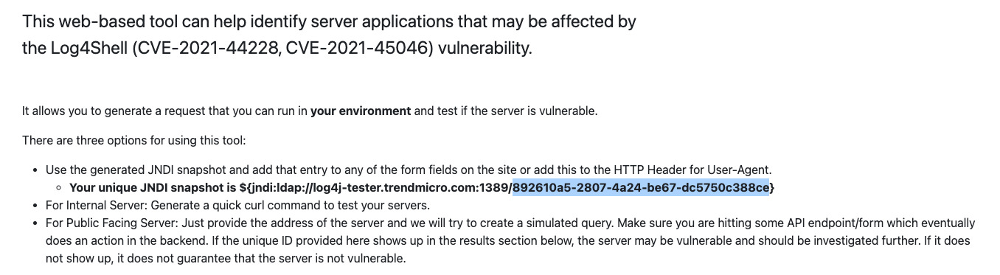
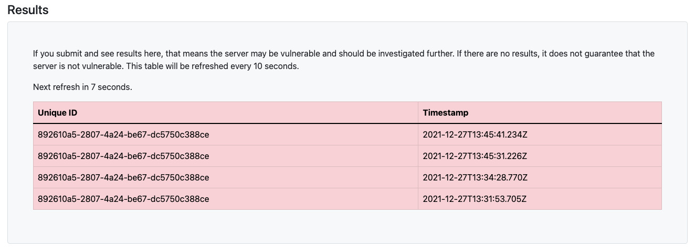

## Introduction

This project intends to debunk two common misbeliefs regarding the impact of the recently discovered Log4j 2.x
vulnerabilities on Java applications for two typical scenarios, as reported by the following CVE records:
- [CVE-2021-44228](https://www.cve.org/CVERecord?id=CVE-2021-44228)
- [CVE-2021-45046](https://www.cve.org/CVERecord?id=CVE-2021-45046)
- [CVE-2021-45105](https://www.cve.org/CVERecord?id=CVE-2021-45105)

The first two, famously nicknamed Log4Shell, enable Remote-Code-Execution, whereas the last one allows a Denial-of-Service.

### Misbelief #1: All Log4j modules from 2.0 to 2.16 were impacted by at least one of these vulnerabilities

Unfortunately, only the description of first CVE explicitly says that only the `log4j-core` module was affected but the other two are vague on this impact.
The official [Apache Log4j Security Vulnerabilities](https://logging.apache.org/log4j/2.x/security.html) page,
more accurately states that only the `log4j-core` was impacted by the 3 recent vulnerabilities.
Therefore, we can safely claim that:

> Your application is immune to those three vulnerabilities if it does not include the `log4j-core` module in the runtime classpath.

### Misbelief #2: If log4-core older than 2.17 is present in the classpath, then my application is _necessarily_ vulnerable 

This one is more subtle. Many applications are based on Spring Boot that, by default, uses Logback as its logger, but also includes some Log4j modules to bridge the Log4J API to SLF4J/Logback, namely:
- `log4j-to-slf4j`
- `log4j-api`

Not rarely, the `log4j-core` is also indirectly included on the runtime classpath by some application dependency. At the end, we have two available implementations (aka "providers") that can be used when the Log4j API is used directly.

As per implemented on [Log4j's LogManager initialization code](https://github.com/apache/logging-log4j2/blob/a19ef9bceeaad862cfc0b50394a7f791d5e17b8c/log4j-api/src/main/java/org/apache/logging/log4j/LogManager.java#L115), only one provider with higher priority is used. Fortunately, `log4j-to-slf4j` has higher priority ([15](https://github.com/apache/logging-log4j2/blob/be881e503e14b267fb8a8f94b6d15eddba7ed8c4/log4j-to-slf4j/src/main/java/org/apache/logging/slf4j/SLF4JProvider.java#L26)) than `log4j-core` ([10](https://github.com/apache/logging-log4j2/blob/be881e503e14b267fb8a8f94b6d15eddba7ed8c4/log4j-core/src/main/java/org/apache/logging/log4j/core/impl/Log4jProvider.java#L26)), ultimately renegading any vulnerable `log4j-core` module into an "inert pathogen".
Again, we can conclude that:

> Your application is also immune if it contains *both* `log4j-to-slf4j` and `log4j-core` in the runtime classpath.

## Usage

The test application uses both SLF4J and Log4j at API and implementation levels.
A command line switch allows you to run the application in two different modes, either including or excluding
the `Log4j-to-slf4j` module.

Either way, it uses both APIs to log a message that would exploit the Log4Shell vulnerability using the TrendMicro's "Log4j Vulnerability Tester" to check if the ethical exploit has succeeded. 

### Step 1: Open TrendMicro's tester page and get your JNDI snapshot

Open the [Log4j Vulnerability Tester](https://log4j-tester.trendmicro.com) page and copy the JNDI snapshot as highlighted below:



### Step 2: Running <u>without</u> `log4j-to-slf4j`

```shell
$ ./gradlew run -Plog4shell --args 892610a5-2807-4a24-be67-dc5750c388ce
```

The Log4j Tester page will display the results:



In the console, the application will output messages similar to:

<pre style="background-color: #2B2B2B">
<b>LOGBACK</b> 13:45:40.798 [main] INFO  main - Using SLF4J: ${jndi:ldap://log4j-tester.trendmicro.com:1389/892610a5-2807-4a24-be67-dc5750c388ce}
<b>LOG4J</b> 13:45:40.806 [main] INFO  main - Using Log4J API: ${jndi:ldap://log4j-tester.trendmicro.com:1389/892610a5-2807-4a24-be67-dc5750c388ce}
<i># ... followed by a long stracktrace ...</i>

<span style="color: #61981D">Logging modules in runtimeClasspath:</span>
<span style="color: #8D7D00">+--- ch.qos.logback:logback-classic:1.2.7
+--- ch.qos.logback:logback-core:1.2.7
+--- org.apache.logging.log4j:log4j-api:2.14.1
+--- org.apache.logging.log4j:log4j-bom:2.14.1
+--- org.apache.logging.log4j:log4j-core:2.14.1
+--- org.slf4j:jul-to-slf4j:1.7.32
+--- org.slf4j:slf4j-api:1.7.32</span>
</pre>

### Step 3: Running <u>with</u> `log4j-to-slf4j`

If you omit the `-Plog4shell` switch, the `log4j-to-slf4j` module will be included in the RT classpath,
and you'll see how it can effectively neutralize the unsafe `log4j-core` module:


```shell
$ ./gradlew run --args 892610a5-2807-4a24-be67-dc5750c388ce
```

At the Log4j Tester page you won't see any message added to the "Results" pane, and in the console you get messages like these:

<pre style="background-color: #2B2B2B">
<b>LOGBACK</b> 13:53:58.733 [main] INFO  main - Using SLF4J: ${jndi:ldap://log4j-tester.trendmicro.com:1389/892610a5-2807-4a24-be67-dc5750c388ce}
<b>LOGBACK</b> 13:53:58.740 [main] INFO  main - Using Log4J API: ${jndi:ldap://log4j-tester.trendmicro.com:1389/892610a5-2807-4a24-be67-dc5750c388ce}

<span style="color: #61981D">Logging modules in runtimeClasspath:</span>
<span style="color: #8D7D00">+--- ch.qos.logback:logback-classic:1.2.7
+--- ch.qos.logback:logback-core:1.2.7
+--- org.apache.logging.log4j:log4j-api:2.14.1
+--- org.apache.logging.log4j:log4j-bom:2.14.1
+--- org.apache.logging.log4j:log4j-core:2.14.1
+--- <b style="color: goldenrod">org.apache.logging.log4j:log4j-to-slf4j:2.14.1</b>
+--- org.slf4j:jul-to-slf4j:1.7.32
+--- org.slf4j:slf4j-api:1.7.32</span>
</pre>
